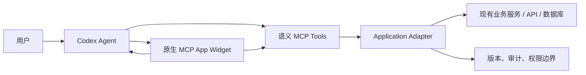

# Agent Plugin Core

一个面向 Codex 的可复用插件底座：把你的现有应用变成一个能在 Codex 右侧打开、能被 Agent 读取状态、调用语义动作、批量执行并验证结果的原生 MCP App。

它抽取了两类实践的优点：

- Cowart 型控制面：项目状态、语义工具、持久化、dry-run、版本保护、审计和 Agent Skill；
- Music Studio 型实时面：前端 Widget 负责高频交互、音视频、Canvas/WebGL 和即时预览。

核心原则：**Agent 操作业务语义，不模拟点击 DOM；前端负责实时体验，MCP Adapter 负责权威状态和副作用。**

## 已包含什么

- 可直接安装的 Codex Marketplace 仓库；
- `text/html;profile=mcp-app` 原生 Widget；
- 自动请求 `fullscreen`，适合 Codex 右侧独立工作区；
- `ui.resourceUri` 和 `openai/outputTemplate` 双元数据兼容；
- 本地 stdio MCP Server；
- 动态注册业务动作：配置一个 action，就得到一个独立 MCP Tool；
- 通用 `execute_app_action` 兼容入口；
- 原子 `apply_app_operations` 批处理；
- `dryRun` 预演；
- `expectedVersion` 乐观锁；
- 项目级状态与 append-only 审计事件；
- `agent-plugin-operator` 与 `agent-plugin-integrator` 两个 Skills；
- 单元测试和真实 stdio MCP 端到端探针。

## 架构



```text
Codex Plugin
├── Skills                 教 Agent 何时读、何时写、如何确认和验证
├── MCP Server             注册 Widget、核心工具和业务动作
├── Application Adapter    对接你的服务、数据库、SDK 或本地项目
├── Widget Bridge          UI ↔ MCP Tools ↔ Codex 对话
└── Native Widget          复用你的 React/Vue/Svelte/Canvas/WebGL 前端
```

详细设计见 [ARCHITECTURE.md](docs/ARCHITECTURE.md)。

## 安装到 Codex

把这个仓库添加为 Marketplace：

```bash
codex plugin marketplace add https://github.com/cs68614-hash/agent-plugin-core.git --ref main
codex plugin add agent-plugin-core@agent-plugin-core
```

安装后开启一个新的 Codex 任务，让新的 Skills 和 MCP 工具完整加载。然后说：

```text
Open Agent Plugin Core for this project.
```

第一次启动会在插件目录安装 Node 依赖并构建单文件 Widget；以后只有 Widget 源码更新时才重建。

## 五分钟验证

```bash
cd plugins/agent-plugin-core
npm install
npm run quality
```

`quality` 会验证：

1. JavaScript 语法；
2. 配置和 Adapter 契约；
3. 单文件 Widget 构建；
4. Adapter 单元测试；
5. 真实 stdio MCP 连接；
6. Tool 列表和 Widget Resource；
7. 创建、dry-run、版本保护、原子批处理和审计事件。

## 接入你的应用

### 第一步：描述 Agent 可以做什么

编辑：

```text
plugins/agent-plugin-core/config/agent-plugin.config.json
```

每个动作包含明确输入和安全属性：

```json
{
  "name": "publish_article",
  "title": "Publish Article",
  "description": "Publish a reviewed draft to the selected channel.",
  "readOnly": false,
  "destructive": true,
  "idempotent": false,
  "inputSchema": {
    "type": "object",
    "properties": {
      "articleId": { "type": "string", "minLength": 1 },
      "channel": { "type": "string", "enum": ["web", "newsletter"] }
    },
    "required": ["articleId", "channel"],
    "additionalProperties": false
  }
}
```

服务启动时会自动注册一个 `publish_article` MCP Tool。工具名称、描述、JSON Schema 和安全 annotations 会直接暴露给 Agent。

### 第二步：连接真实业务后端

替换：

```text
plugins/agent-plugin-core/app/adapter.mjs
```

Adapter 必须实现：

```js
export function createApplicationAdapter({ config }) {
  return {
    async getCapabilities() {},
    async getState({ projectDir }) {},
    async executeAction({ projectDir, action, input, dryRun, expectedVersion }) {},
    async applyOperations({ projectDir, operations, dryRun, expectedVersion }) {},
    async getEvents({ projectDir, sinceVersion, limit }) {},
  }
}
```

可以连接：

- 现有 Node/Python/Go 服务；
- REST/GraphQL API；
- SQLite/Postgres；
- SaaS SDK；
- 本地工程文件；
- 消息队列和异步任务系统。

完整契约见 [ADAPTER_API.md](docs/ADAPTER_API.md)。

### 第三步：接入现有前端

保留你已有的 React、Vue、Svelte、Three.js、Canvas 或 WebGL 组件，将其入口迁入 `widget/`，并复用：

```js
import { createAgentBridge } from "./agent-bridge.js"

const bridge = createAgentBridge({
  name: "your-app",
  version: "1.0.0",
  defaultDisplayMode: "fullscreen"
})

await bridge.connect()
const state = await bridge.callTool("get_app_state")
await bridge.callTool("publish_article", { articleId, channel })
await bridge.sendMessage("请根据当前选择继续处理")
```

高频、临时、实时操作留在前端：

- 播放头、缩放、拖拽；
- 音频合成、视频预览；
- Three.js 相机交互；
- Canvas/WebGL 绘制；
- 表单草稿。

持久、有副作用、需要审计的操作走 MCP：

- 创建、更新、删除业务对象；
- 发布、发送、审批；
- 权限和预算变更；
- 导出和异步任务；
- 项目版本保存。

### 第四步：教 Agent 正确操作

修改：

```text
plugins/agent-plugin-core/skills/agent-plugin-operator/SKILL.md
```

写清楚：

- 首次操作必须读取哪些状态；
- 哪些动作需要确认；
- 多步工作流怎样 dry-run；
- 版本冲突怎样恢复；
- 完成后验证哪些字段；
- 什么情况下不能自动执行。

## 默认 MCP 接口

| Tool | 用途 |
|---|---|
| `render_agent_app` | 打开原生 Widget |
| `get_app_capabilities` | 读取系统能力和动作契约 |
| `get_app_state` | 读取权威状态与版本 |
| `list_app_actions` | 列出所有语义动作 |
| `execute_app_action` | 通用动作兼容入口 |
| `apply_app_operations` | dry-run 或原子执行多步动作 |
| `get_app_events` | 读取已提交的审计事件 |
| `<configured_action>` | 配置自动生成的业务专用 Tool |

## Agent 自动化的推荐闭环

```text
读取 capabilities
→ 读取 state + version
→ 生成语义操作计划
→ consequential workflow 先 dry-run
→ 必要时请求用户确认
→ 携带 expectedVersion 提交
→ 重新读取 state
→ 检查 audit events
→ 报告对象 ID 和 before/after version
```

这比“让 Agent 点击网页”更稳定，因为模型看到的是业务动作和结构化状态，而不是会变化的 DOM。

## 安全边界

- Widget 显示不等于获得写权限；真实后端仍需认证和授权。
- `destructiveHint` 只是给 Agent 的提示，不能替代服务端权限检查。
- 不把 API Key、OAuth token 或数据库密码放进 Widget、状态或审计事件。
- 发布、支付、删除、外发消息、权限变更应设置确认门。
- 云端多用户系统应使用用户/租户隔离、服务端版本号和不可抵赖审计。
- 默认 JSON Adapter 适合本地单用户模板，不是多人 SaaS 数据库。

详见 [SECURITY.md](docs/SECURITY.md)。

## 仓库结构

```text
.
├── .agents/plugins/marketplace.json
├── docs/
└── plugins/agent-plugin-core/
    ├── .codex-plugin/plugin.json
    ├── .mcp.json
    ├── app/adapter.mjs
    ├── config/agent-plugin.config.json
    ├── server/
    ├── widget/
    ├── skills/
    ├── scripts/
    └── tests/
```

## 文档

- [架构设计](docs/ARCHITECTURE.md)
- [接入步骤](docs/INTEGRATION.md)
- [Adapter API](docs/ADAPTER_API.md)
- [Tool 设计规范](docs/TOOL_DESIGN.md)
- [安全清单](docs/SECURITY.md)

## License

MIT
